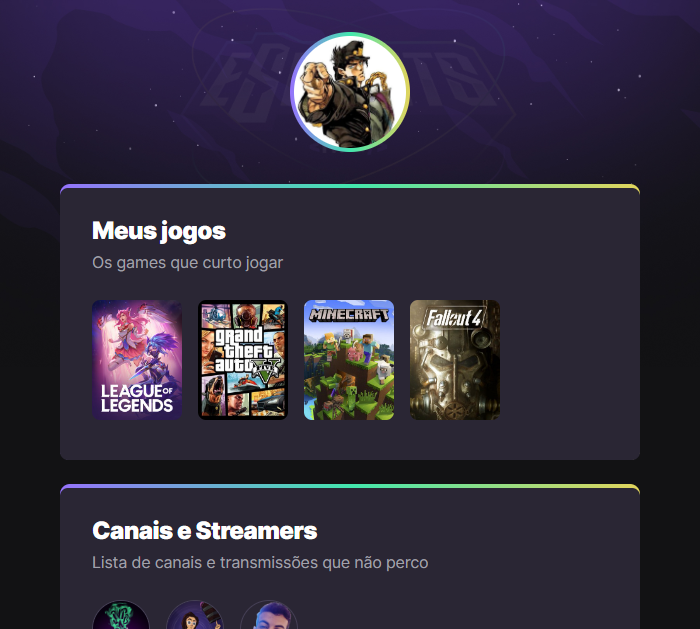

# NLW eSports - Trilha Explorer

Projeto construido do evento Next Level Week da Rocketseat.

[🔗Clique aqui para acessar](https://wendersonvibes.github.io/nlw-esports-explorer-project/)

## 🛠 Tecnologias

- HTML
- CSS
- Git e Github

## 👨‍💻 O que aprendi

Fui inidicado por uma amiga para participar de um evento online de programação: a Next Level Week (NLW) da Rocketseat.

Foi uma semana super produtiva e de muito aprendizado. Antes de ingressar no evento, eu não tinha experiência alguma com produção de página web. Fiquei feliz com o conhecimento que adquiri durante essa semana de estudo. Hoje (16/09/2022) estudo no Instituto Federal do Rio Grande do Norte (IFRN), sengundo ano do ensino médio, campus São Paulo do Potengi (campus SPP), e sou estudante de programação, informática para internet.

Agradeço primeiramente a Deus pela oportunidade e segundamente a minha amiga por ter me indicado esse evento. 😋😊

## 💛 Contato

wenderson1909@gmail.com
